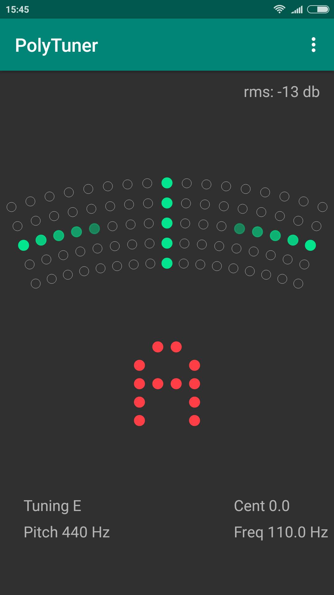
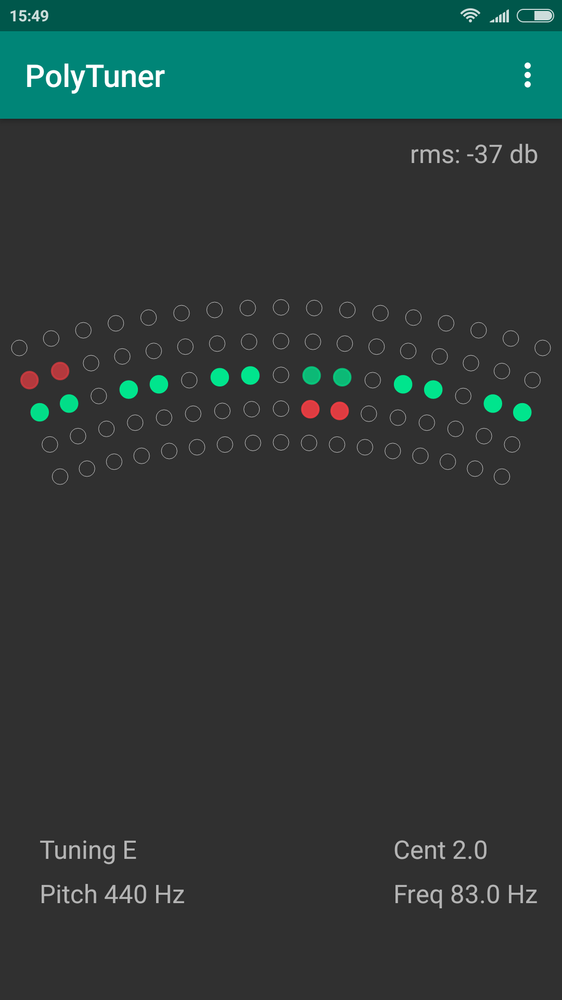
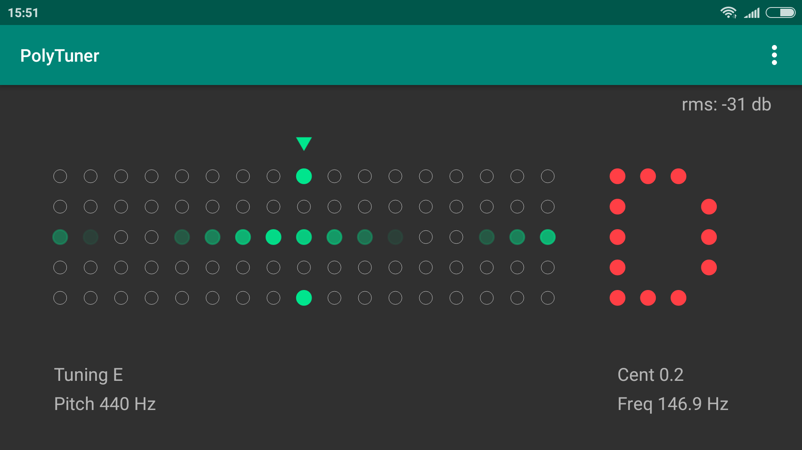

# PolyTuner
Polyphonic Tuner for Android

Features:
* Minimalistic interface
* Fast response
* Chromatic and Polyphonic mode
* Needle and Strobe display
* Tuning Accuracy: ±0.2 cent

## Downloads
[Download apk](https://github.com/eclipse7/PolyTuner/releases/download/v2.0/polytuner-v2.0.apk)

## Screenshots

  
   

